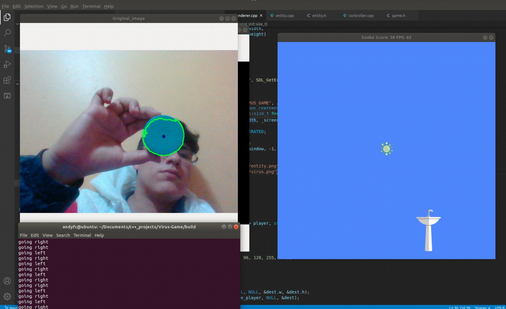
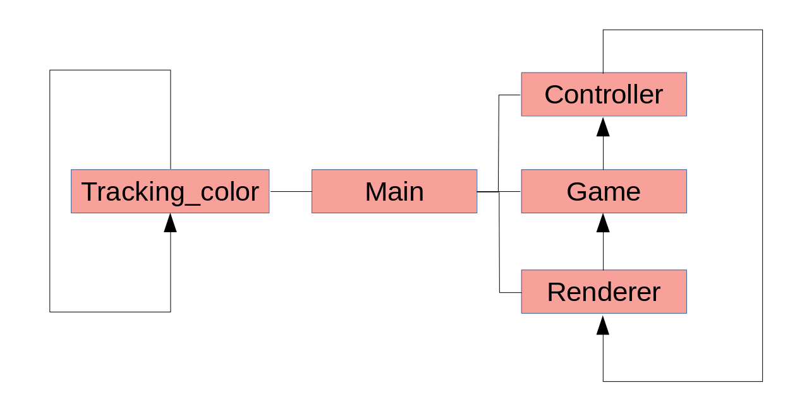

# Virus OpenCV game

The main idea is to kill a virus with the hand washer, either by
pressing the arrows keys (left, right, up, down) or by using the
camera to recognize a blue image that will control the hand
washer.
At the beginning, you can choose between two game modes: the
normal mode and the tracking object mode.
In the normal mode, you move the hand washer by pressing the arrow
keys. Many viruses fall down and you have to catch the virus.
Every time you catch one virus, your score increase

The fun part comes with the mode 2. In this mode, you have to
control the hand washer with your camera and a blue object. I
would recommend to use a blue circle, because the center of the
object represents the goal position. In this mode, you will only
be able to move the object either left or right.

## Dependencies for Running Locally
* cmake >= 2.8
  * All OSes: [click here for installation instructions](https://cmake.org/install/)
* make >= 4.1 (Linux, Mac), 3.81 (Windows)
  * Linux: make is installed by default on most Linux distros
  * Mac: [install Xcode command line tools to get make](https://developer.apple.com/xcode/features/)
  * Windows: [Click here for installation instructions](http://gnuwin32.sourceforge.net/packages/make.htm)
* OpenCV >= 4.1
  * The OpenCV 4.1.0 source code can be found [here](https://github.com/opencv/opencv/tree/4.1.0)
* SDL2
  * You can SDL from [here](https://lazyfoo.net/tutorials/SDL/01_hello_SDL/linux/index.php)
* gcc/g++ >= 5.4
  * Linux: gcc / g++ is installed by default on most Linux distros
  * Mac: same deal as make - [install Xcode command line tools](https://developer.apple.com/xcode/features/)
  * Windows: recommend using [MinGW](http://www.mingw.org/)

## Basic Build Instructions

1. Clone this repo.
2. Make a build directory in the top level directory: `mkdir build && cd build`
3. Compile: `cmake .. && make`
4. Run it: `./Virus`.

## Code Basic Structure
In the game loop, the program works with SDL2. By the other hand, in
the image processing loop, the program works with OpenCV. Both loops are running concurrently.

